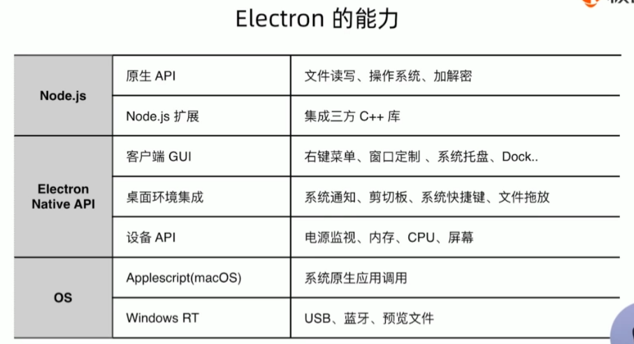
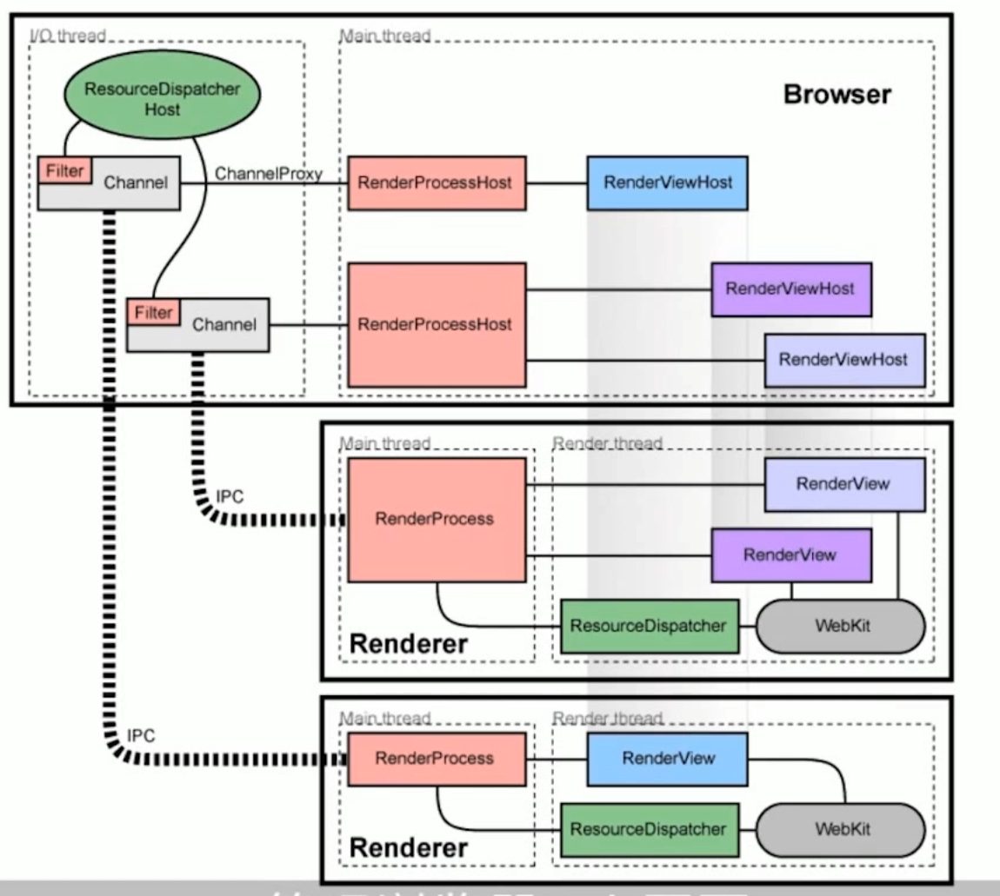
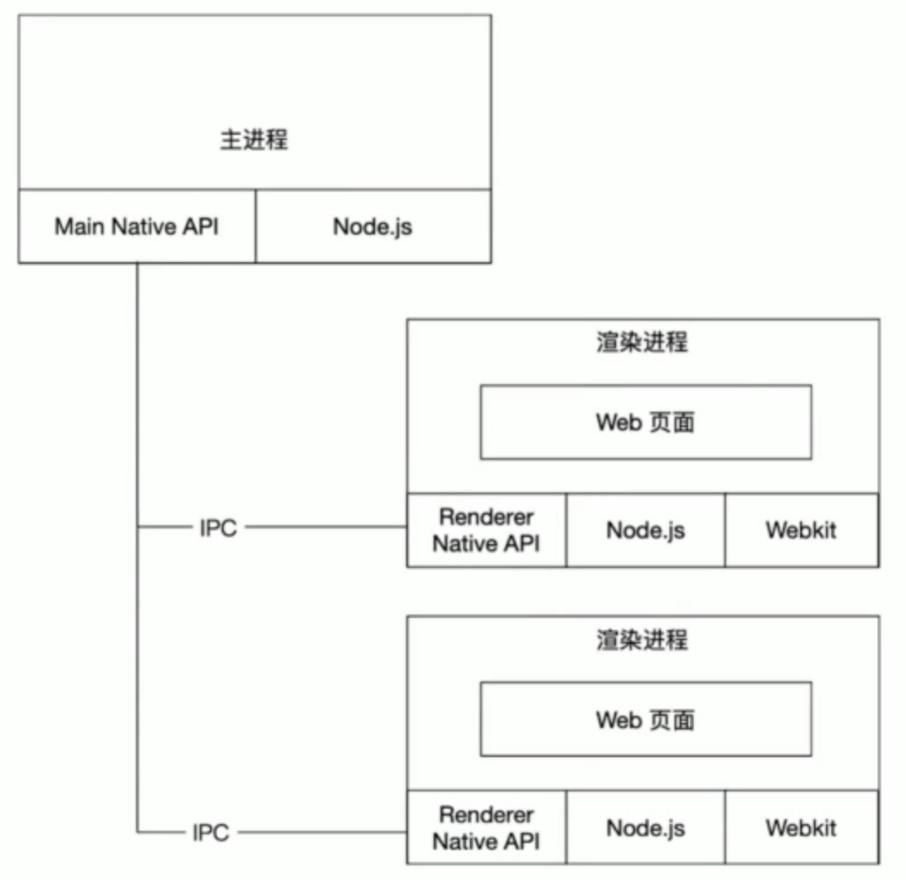
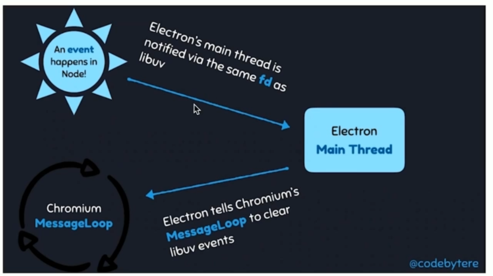
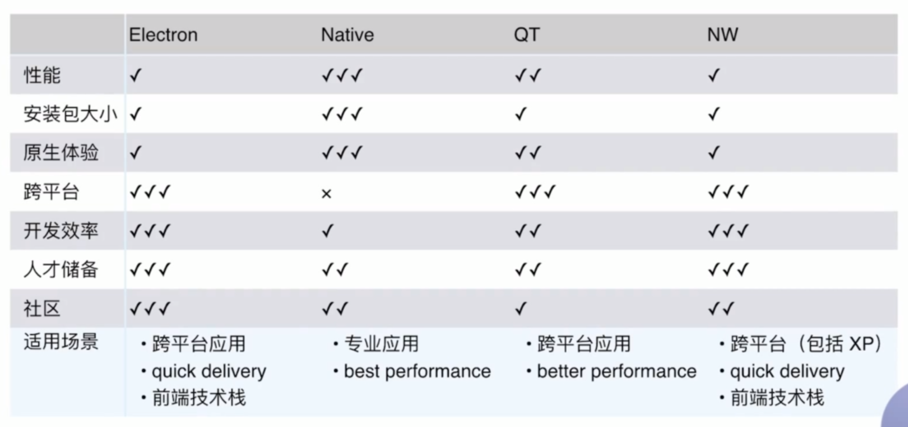

# 学习笔记

## 架构原理
### chromium架构

一个浏览器中会有如下进程：
- 一个browser进程（主进程）
- 多个render进程（渲染进程）

**通信**：进程间通过IPC通信进行通信，`RenderProcessHost`和`RenderProcess`专门用于处理IPC事件

**ResourceDispatcher**：对资源请求进行处理
### electron架构

#### 主进程
- Electron运行`package.json`的main脚本的进程被称为主进程
- 每个应用只有一个主进程
- 管理原生 GUI，典型的窗口 (BrowserWindow、Tray、Dock、Menu)
- 创建渲染进程
- 控制应用生命周期 (app)
#### 渲染进程
- 展示 Web 页面的进程称为渲染进程
- 通过 `Node.js`、`Electron` 提供的 API可以跟系统底层打交道
- 一个 Electron 应用可以有多个渲染进程
### Node.js与Chromiums事件融合
Node.js事件循环基于`libuv`，`libuv`引入了`backend_fd`概念——`libuv`轮询事件的文件描述符；通过轮询`backend_fd`可以知道libuv`的新事件。

Electron创建一个新的安全线程轮询`backend_fd`，Node.js有新事件之后通过`PostTask`转发到chromium的事件循环中：


## 桌面端技术对比
- Native(C++/C#/0bjective-C)
  - 高性能
  - 原生体验
  - 包体积小
  - 门槛高
  - 迭代速度慢
- QT
  - 基于C++
  - 跨平台(Mac、Windows、ios、Android、Linux、嵌入式)
  - 高性能
  - 媲美原生的体验
  - 门槛高
  - 迭代速度一般
- Fluter
  - 跨端(ios、Android、Mac、Windows、Linux、Web)
  - PC 端在发展中 (Mac > Linux、Windows)
  - 基建少
- NW.js
  - 跨平台 (Mac、Windows、Linux)，v0.14.7支持XP(XP 市场份额约为15%)
  - 迭代快，Web 技术构建
  - 源码加密、支持 Chrome 扩展
  - 不错的社区
  - 包体积大
  - 性能一般
- Electron
  - 跨平台 (Mac、Windows、Linux、不支持 XP)
  - Web 技术构建
  - 活跃的社区
  - 大型应用案例
  - 包体积大
  - 性能一般

## IPC模块通信
Electron 提供了IPC通信模块，主进程的[ipcMain](https://www.electronjs.org/zh/docs/latest/api/ipc-main#%E6%96%B9%E6%B3%95)和渲染进程的[ipcRenderer](https://www.electronjs.org/zh/docs/latest/api/ipc-renderer)

ipcMain、ipcRenderer 都是 [EventEmitter](https://nodejs.org/api/events.html#events_class_eventemitter) 对象
### 渲染进程到主进程通信
callback写法：
```typescript
// 在渲染进程中
const { ipcRenderer } = require('electron');
ipcRenderer.send('message', 'Hello from Renderer');

// 在主进程中
const { ipcMain } = require('electron');
ipcMain.on('message', (event, arg) => {
  console.log(arg); // 输出: Hello from Renderer
});
```
Promise写法（适用于等待主进程处理结果，最好定义超时限制避免卡死）：
```typescript
//主进程
ipcMain.handle('invoke-example', async (event, arg) => {
  console.log(arg); // 打印来自渲染进程的参数
  return 'Hello from Main Process'; // 返回结果给渲染进程
});

//渲染进程
const result = await ipcRenderer.invoke('invoke-example', 'Hello from Renderer');
console.log(result); // 打印来自主进程的结果
```
### 主进程到渲染进程通信
```typescript
// 主进程
mainWindow.webContents.send('message-from-main', 'Hello from Main Process');

// 渲染进程监听主进程发来的消息
ipcRenderer.on('message-from-main', (event, arg) => {
  console.log(arg); // 打印来自主进程的消息
});
```
### 渲染进程间的通信
- 通知事件：[ipcRender.sendTo](https://www.electronjs.org/zh/docs/latest/api/ipc-renderer#ipcrenderersendtowebcontentsid-channel-args-%E5%B7%B2%E5%BA%9F%E5%BC%83)
- 数据共享：通过web技术如localStorage、sessionStorage、indexDB等
## 软件更新
更新方式对比

| 更新方式 | 手动更新                     | 文件覆盖                   | 自动更新     | 操作系统          |
|------|--------------------------|------------------------|----------|---------------|
| 优点   | 简单、稳定                    | 现在过程快                  | 稳定、快、打扰少 | 统一、稳定         |
| 缺点   | 过程繁琐、慢、影响使用、更新效率低        | 慢、实现比较复杂、稳定性差、写文件可能会失败 | 实现复杂     | 受应用商店局限       |
| 适用场景 | 低频更新、用户粘性高、作为各种版本升级的降级方案 | 打补丁                    | 高频更新软件、体验要求高| 操作系统应用商店上架的软件 |

----
electron更新方案：
- web化：渲染进程代码放置在远程服务器
  - 优点：更新快、体验好
  - 缺点：无法离线使用、主进程更新复杂，有多版本兼容问题
  - 场景：重业务、壳子更新少
- 文件覆盖
  - 优点：简单直接、快速生效、轻量级
  - 缺点：不可逆、无法处理运行中的应用、可能存在潜在的安全风险
- 官方自动更新
- electron-updater
  - 优点：介入简单、windows支持签名验证、支持进度条、方便配合electron-builder使用
  - 缺点:windows系统中更新没有内置更新好、windows中存在权限问题

更新相关技术：
- 增量更新：只更新需要更新的地方
  - 增量包(差分包、补丁包):新旧包的差异包
  - 增量技术：
    - bsdiff/bspatch: 适用二进制文件、开源、免费、广泛使用(尤其移动端)
    - Xdelta3:适用于二进制
    - Courgette:谷歌提出的方案，是bsdiff的优化版本
    - RTPatch:商业付费
- 灰度发布：客户端无法回滚，根据规则逐渐放量发布