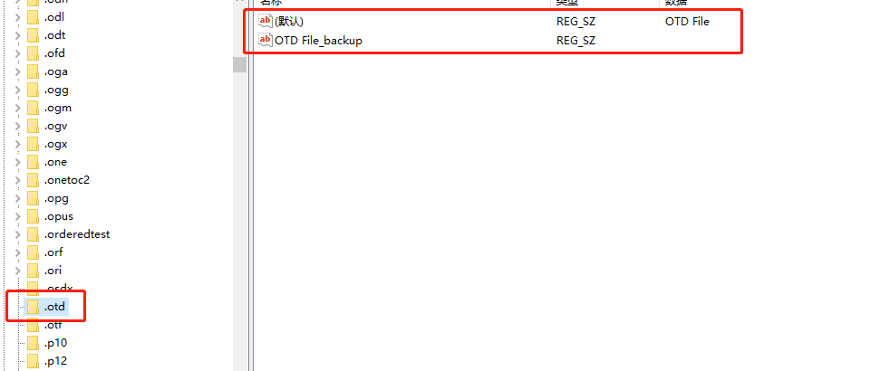
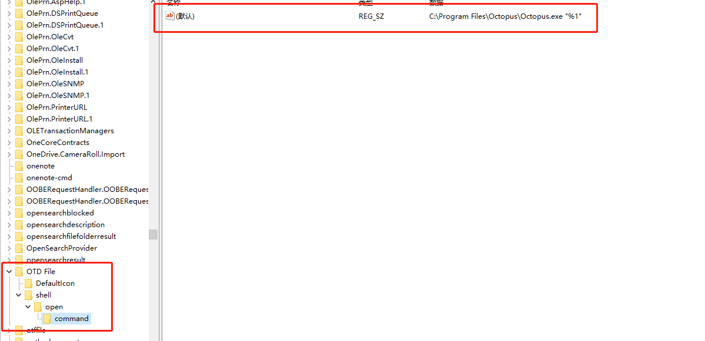

# 01.electron实现应用关联文件

网上有各种支持方案如NSH脚本，但是都需要我们自己通过脚本手动写（需要区分平台，windows写入注册表，Mac是写Info.plist），花费的时间成本偏高。
幸运的是，在electron-builder版本19.0.0中引入的fileAssociations配置能够帮我们做好这些事情，我们只需要写好相应的处理代码就行



## electron-builder配置

通过electron-builder配置：

```json
{
  fileAssociations: {
    // 扩展名
    ext: 'otd',
    // 描述名
    name: 'OTD File'
  }
}
```

## 监听文件打开

`main.ts`中添加对应事件监听，这些事件会在关联文件双击时触发

- windows通过`second-instance`事件
- mac通过`open-file`事件，但需要注意的是**需要在应用启动的时候(甚至在`ready`事件发出前) 就对`open-file`事件进行监听**
  ，参考[官方文档](https://www.electronjs.org/zh/docs/latest/api/app#%E4%BA%8B%E4%BB%B6-open-file-macos)

```ts
import {app} from 'electron';

const handleOpen = async (path: string) => {
  await app.whenReady();
  // 获取文件路径
  const filePath = decodeURIComponent(path);
  // 执行对应的操作，如发送IPC、存储数据等操作
  // ...
};
/** Mac 自定义协议启动事件处理，注册必须先于ready事件触发 */
app.on('open-file', (event, filePath) => {
  event.preventDefault();
  // 只处理指定文件后缀名的情况
  if (!filePath.endsWith('.otd')) {
    return;
  }
  // 如果应用就绪直接处理
  if (app.isReady()) {
    handleOpen(filePath);
    return;
  }
  // 未就绪则通过定时器等待就绪（直接通过协议启动应用的情况）
  app.whenReady().then(() => {
    handleOpen(filePath);
  })
});
/** Windows，应用在启动后才会触发，所以直接调用逻辑即可 */
app.on('second-instance', (_, argv) => {
  appendOtdImportLog(JSON.stringify(argv));
  const path = argv.find((v) => v.endsWith('.otd'));
  path && handleOpen('second-instance', path);
});
```

## 处理未打开应用时双击打开文件的情况

Mac系统中双击文件会触发一次`open-file`事件，**需要在应用启动的时候(甚至在`ready`事件发出前) 就对`open-file`事件进行监听**
，所以只需要在事件监听器中添加这种情况的特殊处理：

```ts
import {app} from 'electron';

app.on('open-file', (event, filePath) => {
  // ...
  // 未就绪则通过定时器等待就绪（直接通过协议启动应用的情况）
  app.whenReady().then(() => {
    handleOpen(filePath);
  })
});
```

Windows系统则**需要通过解析`process.argv` (在主进程中) 来获取文件路径**，可以在`ready`事件中处理:

```ts
import {app} from 'electron';

const openPath = process?.argv?.find((v) => v.endsWith('.otd')) ?? '';
// 启动应用程序时有文件路径参数则执行打开操作
if (openPath) {
  app.whenReady().then(() => {
    handleOpen(openPath);
  })
}
```

## 处理多窗口

应用遇到这些情况：

- 多窗口之间数据共享
- 多个窗口同时开启，只有一个窗口需要响应
- 主窗口关闭导致文件关联响应不执行，主窗口关闭，需要重新打开主窗口

### 多窗口之间数据共享问题

可通过`localStorage`
共享数据，可在主进程中通过[executeJavaScript](https://www.electronjs.org/zh/docs/latest/api/web-contents#contentsexecutejavascriptcode-usergesture)
方法存储`localStorage`数据

```ts
import {BrowserWindow} from 'electron';

const mainWindows = BrowserWindow.getAllWindows();

if (!mainWindows.length) {
  return;
}
const {webContents} = mainWindows[0];
// 存储路径
await webContents.executeJavaScript(`localStorage.setItem("OTD_OPEN_PATH", "${encodeURIComponent(filePath)}")`);
```

### 主窗口响应

在文件打开事件监听器中发送IPC，由于不知道哪个窗口处于打开状态，所以向所有窗口发送IPC（实际只有一个窗口响应，没打开就不会响应）

```ts
import {BrowserWindow} from 'electron';

const mainWindows = BrowserWindow.getAllWindows();
// 向所有窗口发送IPC
mainWindows.forEach((win) => {
  const {webContents} = win;
  const url: string = webContents.getURL();
  // 向渲染进程发送
  webContents?.send('otd-open', filePath);
});
```

主窗口监听IPC并在渲染时读取`localstorage`并删除：

```ts
import {ipcRenderer, remote} from 'electron';

const handleImport = (filePath: string) => {
  deletePath();
  // 执行文件打开操作
};

// 进入主窗口执行一次
const filePath = getPath();
if (filePath && mainClientStore) {
  handleImport(filePath);
}

ipcRenderer.on('otd-open', (_, filePath: string) => {
  remote.getCurrentWindow().focus();
  handleImport(filePath);
});
```

## 遇到问题

- windows中通过自己写的C++包`oap-zh`对文件进行校验，其中windows下的路径是拼出来的，通过命令行或者双击快捷方式没有问题，当双击文件关联启动时传入的是绝对路径，这时候路径错误，启动程序退出
    - 修改`AOP`包并重新打包，
    - 重新打包验证